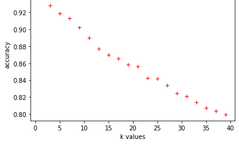

<!-- PROJECT LOGO -->
<br />
<p align="center">
  <h3 align="center">Mexican Sing Language Recognition Using K-Nearest-Neighbords </h3>
</p>


<!-- TABLE OF CONTENTS -->


<!-- ABOUT THE PROJECT -->
## About The Project

This project is about Sign Recognition using an Instance Based Modelling Algorithm, in this case: 'K-nearest-neighbords', the selection of the best K is obtained analyzing the accuracy behavior with a proposed validation set. K-Nearest-Neighbords(KNN) it's a simple but powerful algorithm that can deal with image recognition as shown.


### Built With

* [Numpy](https://numpy.org/)
* [Pandas](https://pandas.pydata.org/)
* [matplotlib](https://matplotlib.org/stable/index.html)
* [scikit-learn](https://scikit-learn.org/stable/)

For this project there is no need to have installed Jupyter Notebook since all code
was made to be exacuted in command line or Spyder.

<!-- GETTING STARTED -->
## Getting Started

To get a local copy up and running follow these simple steps.

### Installation

1. Clone the repo
   ```sh
   git clone https://github.com/AlfredoAcosta/MSL_Recognition_KNN.git
   ```
2. Look for the rute of the file an type:
   ```sh
   python3 KnearestNeighbords.py
   ```

This process takes a long since KNN it's computationally expensive because for each new item to be classified the algorithm
recalculate de distance between all the training data set.

<!-- USAGE EXAMPLES -->
## Dataset

The dataset consist of a matrix of size (10500,6336),wich represent 10500 images of 88 pixels widht and 72 pixels height. This dataset is of own creation.

Showing a random element of the dataset:


<!-- ROADMAP -->
## Results and discussion

_Choosing the best value for K_

A train an a validation test is used to see the accuracy behavior with K between [1,39].  



It seems that the best value for K it's K=1, but choosing that would be the system very unstable to noise and changing of features. So as suggest in [Aryanie, (2015)](https://ieeexplore.ieee.org/abstract/document/7231481/), a better value for K could be K=3.

There are proposed differents metrics of evaluation that are shown in the next table. Also this algorithm is compared with a Convolutional Neural Network wich it's described with more details in [this repository](https://github.com/AlfredoAcosta/MSL_Recognition_CNN).

| Metric of evaluation | Accuracy | Presicion | Recall | f1-score |
|:--------------------:|:--------:|:---------:|:------:|:--------:|
|       KNN (K=3)      |   94.71  |   94.78   |  94.71 |   94.71  |
|          CNN         |   97.85  |   98.67   |  97.67 |   97.87  |

<!-- CONTRIBUTING -->
## Contributing
I'll appreciate if you have some comments or contributions to this project.

1. Fork the Project
2. Create your Feature Branch (`git checkout -b myBranch`)
3. Commit your Changes (`git commit -m 'Add some content'`)
4. Push to the Branch (`git push origin myBranch`)
5. Open a Pull Request


<!-- LICENSE -->
## License

Distributed under the MIT License.

<!-- CONTACT -->
## Contact

[LinkedIn](https://www.linkedin.com/in/alfredo-antonio-estevez-acosta-544877170/)
